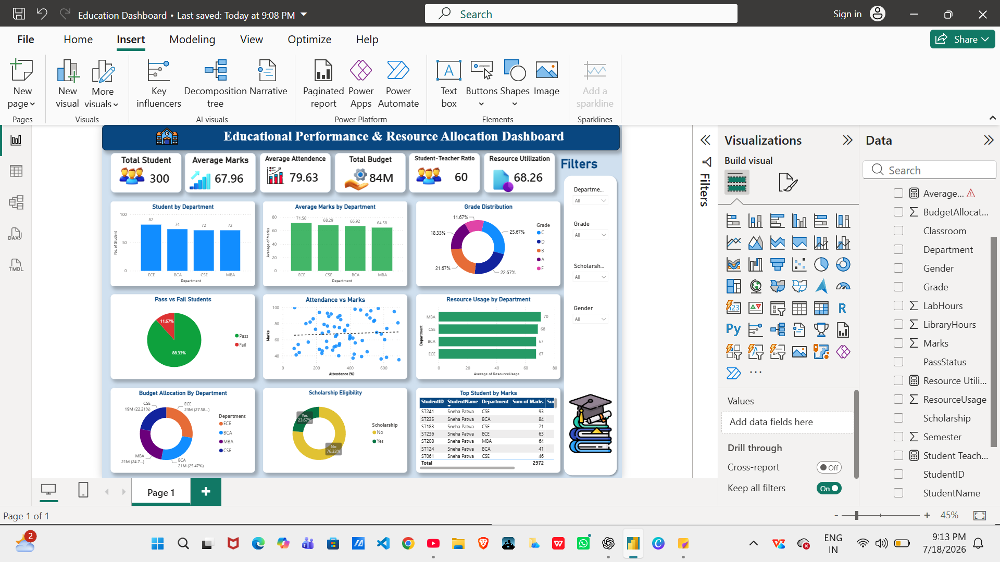

# HR Analytics Dashboard

## Project Overview

This project presents an interactive HR Analytics Dashboard developed using Microsoft Power BI.

The dashboard helps HR professionals analyze employee data, monitor workforce trends, and support data-driven decision-making.

---

## Features

- Total Employees
- Employee Attrition Analysis
- Attrition Rate
- Average Monthly Income
- Job Satisfaction Analysis
- Performance Rating Analysis
- Department-wise Employee Distribution
- Work-Life Balance Analysis
- Overtime vs Attrition
- Interactive Filters

---

## Tools Used

- Microsoft Power BI
- Excel/CSV Dataset
- DAX
- Data Visualization

---

## Dashboard Preview

---

## Insights

- Department-wise employee distribution
- Attrition analysis
- Employee satisfaction trends
- Performance analysis
- Workforce management insights

---

## Author

Your Name
